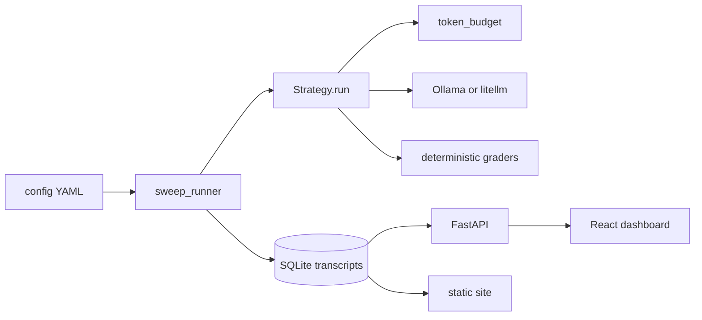

# SampleMoreStudio# SampleMoreStudio

[](LICENSE)
[](https://www.python.org/downloads/)
[](https://nodejs.org/)
[](#limitations--non-goals)

**Repo:** [github.com/Onur45500/SampleMoreStudio](https://github.com/Onur45500/SampleMoreStudio)

**At matched token cost, independent sampling tends to beat self-critique loops.**

SampleMoreStudio is an open-source **benchmark harness + live dashboard** that tests that claim under equal completion-token budgets — first on single-turn reasoning tasks, then on short tool-using agent scaffolds. Local models (Ollama) are first-class so you can reproduce at ~$0.

This is an **independent reproduction / extension** inspired by the 2026 *Sample More, Reflect Less* finding. It is **not** a copy of that paper’s harness.

---

## Why it exists

Prompt-engineering folklore and many agent scaffolds favor **self-critique loops** (Self-Refine, Reflexion). A competing idea is simpler: spend the same token budget on **independent samples** and aggregate (majority vote / best-of-N).

SampleMoreStudio makes that comparison **auditable**:

- Same model, same temperature, same total **completion-token** budget `B`
- Full transcripts (every sample, critique, tool call)
- Deterministic graders (no LLM-as-judge)
- Dashboard charts for the “reflect loses” delta, budget curves, and turn-by-turn inspection

Results are always scoped: *on this suite, at these budgets, with these models*.

---

## What’s included

- **Equal-cost sweep harness** — every `(model × strategy × task × budget × seed)` cell, resume-safe
- **8 strategies** — Phase 1: CoT, Self-Refine, Best-of-N, Majority-Vote@K · Phase 2: ReAct, Plan-then-Act, Reflexion, Majority-of-N-agent
- **~120 tasks** — math (offline GSM8K slice), code, logic, and fake file/JSON/calc tool tasks
- **React dashboard** — live monitor, leaderboard, delta charts, budget curves, run explorer, transcript viewer (+ side-by-side compare); see [Dashboard features](#dashboard-features)
- **Static export** — dump SQLite → JSON + frontend build for a backend-free publishable site

---

## Dashboard features

Open [http://localhost:5173](http://localhost:5173) after starting the API and frontend. The **left sidebar** has a **Phase** filter (Phase 1 / Phase 2 / Combined) that applies across all views, plus navigation to each page.

| View | Route | What it does |
|------|-------|----------------|
| **Live Monitor** | `/` | Default landing page. Sweep progress bar, ETA, current model/strategy/task/budget, live leaderboard preview, token/cost gauges, auto-scrolling log tail. Start a named **preset** or **Stop** a running sweep. |
| **Leaderboard** | `/leaderboard` | Sortable aggregates per `(model, strategy, budget)`: accuracy, tokens spent vs target, **`n_or_k`**, **`per_sample_cap`**, **`truncation_rate`**, tool calls (Phase 2), overshoot count. CSV export. |
| **Delta Charts** | `/delta` | Signature “reflect loses” grouped bar chart (accuracy by model × strategy at a selected budget). Hero Δ callout with paired bootstrap CI. Toggle **refine before/after** for Self-Refine / Reflexion (initial draft vs final answer). |
| **Budget Curves** | `/budget-curves` | Line chart: accuracy vs token budget, one line per strategy (does sampling-vs-reflect hold as `B` grows?). |
| **Run Explorer** | `/runs` | Every individual run (filter by strategy / correct). Click a row’s model link to open that run’s transcript. |
| **Transcript Viewer** | `/runs/:runId` | Turn-by-turn cards: role, label (e.g. `sample_2_of_4`, `critique_round_1`, tool call/result), tokens, truncation flag, full content. Target vs spent budget bar (red if overshoot). |
| **Side-by-side compare** | `/compare?a=…&b=…` | From **Run Explorer**, click **A** on one run and **B** on another (same task recommended), then **Compare A/B**. Two transcripts, final answers, and correctness side by side — ideal for “why did Majority-Vote win and Self-Refine lose on this problem?” screenshots. |
| **Tasks** | `/tasks` | Task catalog with category, prompt preview, and pass-rate across runs (spot broken/outlier tasks). |

**How to open a transcript**

1. Sidebar → **Run Explorer**
2. Click the **model** link on any row → Transcript Viewer

**How to compare two strategies on the same task**

1. Run Explorer → click **A** on e.g. `self_refine` / `math_003`
2. Click **B** on `majority_vote` / same `math_003`
3. Click **Compare A/B**

You need finished runs in the DB first (`python scripts/cli.py phase0 …` or a sweep). Live Monitor polls `/api/progress` every 2s (no SSE required).

---

## Architecture



| Piece | Location |
|-------|----------|
| Budget engine | [`backend/token_budget.py`](backend/token_budget.py) |
| Strategy interface | [`backend/strategies/base.py`](backend/strategies/base.py) |
| Sweep + resume | [`backend/sweep_runner.py`](backend/sweep_runner.py) |
| API | [`backend/main.py`](backend/main.py), [`backend/api/`](backend/api/) |
| Dashboard | [`frontend/src/`](frontend/src/) |
| Config | [`config/`](config/) (`models.yaml`, `budgets.yaml`, `strategies.yaml`, `sweeps.yaml`) |
| Tasks | [`tasks/`](tasks/) |

The unifying abstraction is a **Strategy**:

```text
run(task, model, token_budget) → transcript + final_answer + tokens_spent
```

Everything else (grading, storage, dashboard) is strategy-agnostic and shared across phases.

---

## Equal-cost methodology

**Primary budget = completion tokens.** Prompt tokens and estimated $ cost are recorded alongside but do not consume `B`.

**Invariant:** never exceed `B`. Undershoot is normal (models stop early). Overshoot &gt; 10% is flagged. Every generation records a `truncated` flag.

### Scaled sample caps (V2)

A fixed per-sample cap (e.g. always 128) silently truncates Best-of-N / Majority-Vote while CoT uses the full `B`. Defaults in [`config/budgets.yaml`](config/budgets.yaml):

- `sample_cap = max(128, B × 0.25)` → 256→128, 512→128, 1024→256, 2048→512
- `selection_cap = max(64, B × 0.125)`

The leaderboard exposes `n_or_k`, `per_sample_cap`, and `truncation_rate` so fairness is auditable.

### Formulas

| Strategy | Allocation |
|----------|------------|
| **CoT** | One call, `max_tokens = B` |
| **Self-Refine(R)** | Even split across `2R+1` slices (initial + R×(critique + revision)); unspent rolls forward |
| **Best-of-N** | `N = floor((B − S_sel) / S_sample)`; selection is a model call |
| **Majority-Vote@K** | `K = floor(B / S_sample)`; selection free (counting) — `K` can exceed BoN’s `N` |
| **Phase 2 scaffolds** | Budget across the multi-turn loop; early stop + `budget_exhausted` if needed |
| **Majority-of-N-agent** | N independent agent attempts within `B`, then majority vote |

All strategies use the **same temperature** (default `0.7` in [`config/models.yaml`](config/models.yaml)).

---

## Quickstart

### Clone

```bash
git clone https://github.com/Onur45500/SampleMoreStudio.git
cd SampleMoreStudio
```

### Prerequisites

- Python 3.11+
- Node 20+
- [Ollama](https://ollama.com) with a local model matching config, e.g.:

```bash
ollama pull qwen2.5:7b-instruct-q4_K_M
```

### Setup

**Windows**

```powershell
.\setup.ps1
.\.venv\Scripts\Activate.ps1
$env:PYTHONPATH = (Get-Location).Path
```

**Unix**

```bash
chmod +x setup.sh && ./setup.sh
source .venv/bin/activate
export PYTHONPATH="$(pwd)"
```

### Phase 0 signal check

```powershell
python scripts/cli.py phase0 --tasks 20 --seeds 1 --budget 512
```

Runs Self-Refine vs Majority-Vote on math, dumps transcripts under `results/transcripts/`, and prints Δpp + budget integrity.

### Dashboard (two terminals)

```powershell
# Terminal 1
uvicorn backend.main:app --reload --port 8000

# Terminal 2
cd frontend
npm run dev
```

Open [http://localhost:5173](http://localhost:5173).

### Docker

```bash
docker compose up --build
```

Ollama must be reachable from the backend container (`host.docker.internal` on Docker Desktop).

### Port already in use (`WinError 10013`)

```powershell
Get-NetTCPConnection -LocalPort 8000 | Select-Object OwningProcess
Stop-Process -Id <pid> -Force
```

Or use `--port 8001`.

---

## Sweep presets & CLI

Named presets live in [`config/sweeps.yaml`](config/sweeps.yaml):

```powershell
python scripts/cli.py sweep --preset phase0
python scripts/cli.py sweep --preset phase1_publish   # resume-safe; long-running
python scripts/cli.py sweep --preset phase2_publish
```

Overrides: `--seeds`, `--budgets`, `--categories`, `--task-limit`, `--models`, `--strategies`.  
The dashboard **Start preset** control uses the same presets. Re-run to resume; completed cells are skipped.

```powershell
python scripts/cli.py generate-tasks   # rebuild task JSON from generators / offline GSM8K slice
python scripts/test_budget.py          # budget + extraction unit tests
python scripts/summarize.py            # quick leaderboard dump from SQLite
```

---

## Extending

- **Model** — edit [`config/models.yaml`](config/models.yaml) (`ollama/...` local, or OpenRouter via `.env` `OPENROUTER_API_KEY`)
- **Task** — add JSON under `tasks/phase1_reasoning/<cat>/` or `tasks/phase2_agent/<cat>/` with `id`, `prompt`, `answer`, `grader`, `grader_params`
- **Strategy** — implement `Strategy` under `backend/strategies/`, register in [`config/strategies.yaml`](config/strategies.yaml) and [`backend/strategy_registry.py`](backend/strategy_registry.py)

---

## Static export

```powershell
python export/build_static_site.py --build
```

Writes a backend-free site to `export/out/` (including transcripts).

---

## Preliminary findings

Numbers below are from **small local smokes** on `qwen2.5:7b-instruct-q4_K_M`. Treat them as signal checks, not a published claim. Larger `phase1_publish` / `phase2_publish` sweeps (with bootstrap CIs) should replace these when complete — please open an issue or PR with updated tables rather than overstating early results.

### Phase 0 (B=256, 6 math, 1 seed)

| Strategy | Accuracy |
|----------|----------|
| Majority-Vote | **16.7%** (n=6) |
| Self-Refine | **0.0%** (n=6) |

Δ ≈ **+16.7 pp** (sampling over reflecting); CI wide at this `n`. Budget spent/target ≈ 1.0, 0 overshoot flags. At B=256 with thin slices, Self-Refine rarely emits a usable `Answer:`.

### Phase 1 compact (B=512, 8 math, 1 seed; pre–scaled-cap era)

| Strategy | Accuracy | Tokens spent / target |
|----------|----------|------------------------|
| CoT | **87.5%** | 195/512 |
| Best-of-N | 37.5% | 483/512 |
| Majority-Vote | 12.5% | 511/512 |
| Self-Refine | **0.0%** | 512/512 |

**Majority-Vote beat Self-Refine** on the claim under test. CoT won overall in part because fixed `sample_token_cap=128` truncated multi-sample strategies — V2 **scales caps with B** to reduce that confound.

### Phase 2 compact (B=512, 6 tool tasks, 1 seed)

| Strategy | Accuracy | Avg tool calls |
|----------|----------|----------------|
| Plan-then-Act | **83.3%** | 1.0 |
| Reflexion | 66.7% | 2.5 |
| ReAct | 33.3% | 1.3 |
| Majority-of-N-agent | ~30%+ | ~0.8–2 |

On short deterministic tool tasks, a single good plan can win; Majority-of-N needs enough tokens **per attempt** for a full Action/Observation loop.

Transcript dumps: `results/transcripts/sweep_*/*.txt`.

---

## Limitations & non-goals

**Limitations**

- Compare strategies **within** a model; local vs API absolute skill differs
- Small `n` → wide CIs on hero Δpp
- Allocation formulas are necessarily somewhat arbitrary (documented above)
- Offline GSM8K slice may be contaminated for absolute accuracy; rankings are the target claim
- Code grading = `subprocess` + timeout — **not** a security boundary
- Run from repo root (`PYTHONPATH`); not published as a PyPI package

**Non-goals (v1/v2)**

- No LLM-judge grading  
- No auth / multi-tenant SaaS  
- No distributed multi-GPU orchestration  
- No fine-tuning  
- No claim of universal settlement of “sample vs reflect”

---

## Contributing

Contributions welcome — see [`CONTRIBUTING.md`](CONTRIBUTING.md) for setup, tests, and how to add models / tasks / strategies.

Good first directions: more offline tasks, preset docs, dashboard UX polish, reproducing a publish sweep and updating the preliminary findings table with CIs.

---

## License

[MIT](LICENSE)
